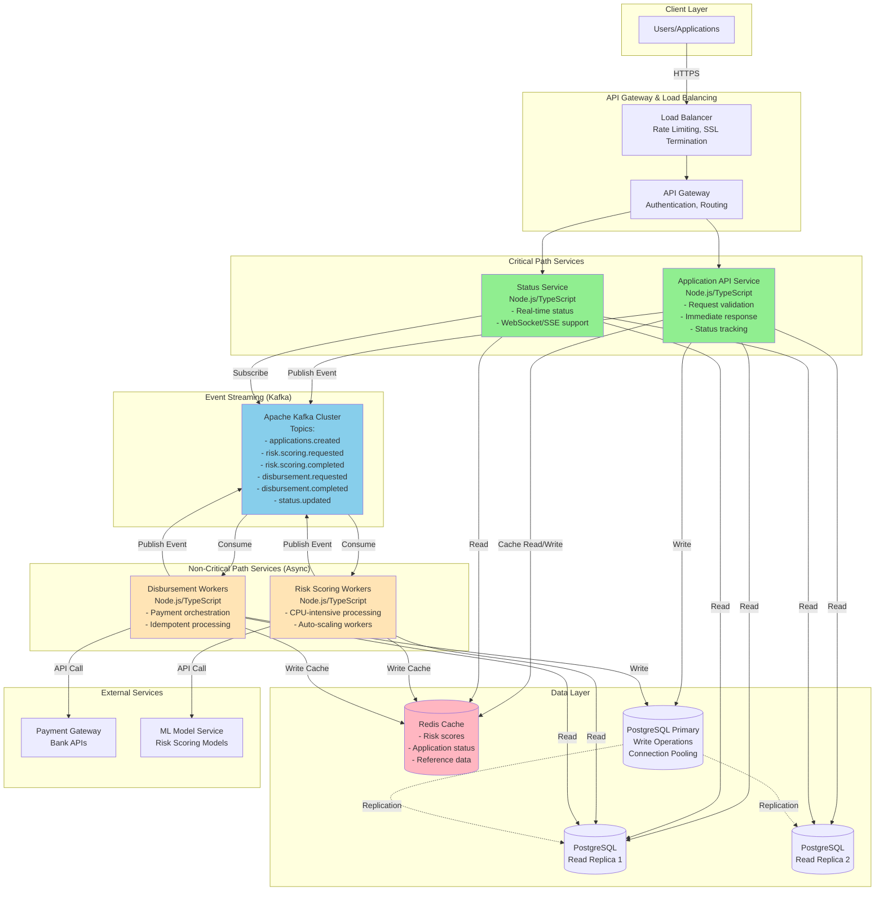

# Architecture Solution: Scalable SME Funding Platform

## Problem Statement

Planning for **10x growth** in SME funding applications over 12 months. Current monolithic Node.js + TypeScript + PostgreSQL service shows performance bottlenecks during peak traffic, particularly around:
- **Data consistency** issues during peak loads
- **Latency** spikes during high traffic
- **CPU-intensive risk scoring** blocking request processing

## Solution Overview

Loom Video:

https://www.loom.com/share/b56be64e8eb64a1691e8324aef4d37ba
https://www.loom.com/share/ce826e835bc5476ab77fed997a52282f


**Core Strategy:** Separate services based on **critical path** vs. **non-critical path** operations, using Kafka for event-driven architecture and async processing.

### Critical Path Services
- **Application API Service**: Handles user requests, validation, immediate responses
- **Status Service**: Provides real-time status updates for user experience

### Non-Critical Path Services (Async)
- **Risk Scoring Service**: CPU-intensive processing, can be async
- **Disbursement Service**: Payment processing after approval, can be queued

## Architecture Diagram



## Service Breakdown by Critical Path

### Critical Path Services

#### 1. Application API Service
**Purpose:** Handle incoming application requests on the critical path

**Responsibilities:**
- Request validation and sanitization
- Authentication/authorization
- Create application record in database
- Generate tracking ID
- Return immediate response with status "processing"
- Publish `applications.created` event to Kafka

**Performance Requirements:**
- P95 latency < 200ms
- Handle 10x current traffic
- High availability (99.9% uptime)

**Scaling Strategy:**
- Horizontal scaling based on request rate
- Stateless design for easy scaling
- Connection pooling to PostgreSQL

#### 2. Status Service
**Purpose:** Provide real-time status updates for user experience

**Responsibilities:**
- Expose REST API for status queries
- Support WebSocket/SSE for real-time updates
- Subscribe to `status.updated` Kafka topic
- Cache status in Redis for fast lookups
- Fallback to database if cache miss

**Performance Requirements:**
- P95 latency < 100ms (cached)
- Support concurrent WebSocket connections
- Real-time event propagation

**Scaling Strategy:**
- Horizontal scaling for WebSocket connections
- Redis cache for sub-100ms responses
- Kafka consumer groups for event processing

### Non-Critical Path Services (Async)

#### 3. Risk Scoring Workers
**Purpose:** Process CPU-intensive risk scoring asynchronously

**Responsibilities:**
- Consume `risk.scoring.requested` events from Kafka
- Execute risk scoring algorithms (CPU-intensive)
- Call ML model service if needed
- Cache results in Redis (TTL based on model version)
- Publish `risk.scoring.completed` event
- Update application status via `status.updated` event

**Scaling Strategy:**
- Auto-scaling based on Kafka consumer lag
- Separate worker pools for priority levels
- Horizontal scaling for CPU-bound tasks
- Circuit breakers for ML service calls

**Performance:**
- Processing time: seconds to minutes (acceptable for async)
- Retry logic with exponential backoff
- Dead letter queue for failed jobs

#### 4. Disbursement Workers
**Purpose:** Process approved disbursements asynchronously

**Responsibilities:**
- Consume `disbursement.requested` events from Kafka
- Validate application is approved
- Orchestrate payment via payment gateway
- Update application status
- Publish `disbursement.completed` event
- Handle idempotency (prevent duplicate payments)

**Scaling Strategy:**
- Auto-scaling based on queue depth
- Idempotent processing (idempotency keys)
- Retry with exponential backoff
- Dead letter queue for manual review

**Performance:**
- Processing time: seconds to minutes (acceptable for async)
- Strong consistency for financial transactions
- Audit trail for compliance

## Kafka Event Topics

### Topic: `applications.created`
**Producer:** Application API Service  
**Consumers:** Risk Scoring Workers  
**Schema:**
```json
{
  "applicationId": "uuid",
  "userId": "uuid",
  "amount": "decimal",
  "timestamp": "iso8601",
  "metadata": {}
}
```

### Topic: `risk.scoring.requested`
**Producer:** Application API Service (via event router)  
**Consumers:** Risk Scoring Workers  
**Partitioning:** By `applicationId` for ordering

### Topic: `risk.scoring.completed`
**Producer:** Risk Scoring Workers  
**Consumers:** Application API Service, Disbursement Workers  
**Schema:**
```json
{
  "applicationId": "uuid",
  "riskScore": "decimal",
  "status": "approved|rejected|pending_review",
  "timestamp": "iso8601",
  "modelVersion": "string"
}
```

### Topic: `disbursement.requested`
**Producer:** Application API Service (when risk score approved)  
**Consumers:** Disbursement Workers  
**Partitioning:** By `applicationId` for ordering

### Topic: `disbursement.completed`
**Producer:** Disbursement Workers  
**Consumers:** Status Service, Notification Service  
**Schema:**
```json
{
  "applicationId": "uuid",
  "status": "completed|failed",
  "transactionId": "string",
  "timestamp": "iso8601",
  "error": "string|null"
}
```

### Topic: `status.updated`
**Producer:** All services (via event router)  
**Consumers:** Status Service, Notification Service  
**Schema:**
```json
{
  "applicationId": "uuid",
  "status": "processing|risk_scoring|approved|rejected|disbursed|failed",
  "timestamp": "iso8601",
  "metadata": {}
}
```

## Request Flow

### Happy Path Flow

```text
1. User submits application
   ↓
2. Application API Service:
   - Validates request
   - Creates record in PostgreSQL (write)
   - Caches initial status in Redis
   - Returns: { status: "processing", id: "abc123" }
   ↓
3. Publishes `applications.created` event to Kafka
   ↓
4. Risk Scoring Worker consumes event:
   - Processes risk scoring (CPU-intensive, async)
   - Caches result in Redis
   - Updates status in database
   - Publishes `risk.scoring.completed` event
   ↓
5. If approved:
   - Application API Service publishes `disbursement.requested`
   ↓
6. Disbursement Worker consumes event:
   - Processes payment (async)
   - Updates status
   - Publishes `disbursement.completed` event
   ↓
7. Status Service:
   - Consumes `status.updated` events
   - Updates Redis cache
   - Pushes updates via WebSocket to connected clients
```

### Status Query Flow

```text
1. User queries status via Status API
   ↓
2. Status Service:
   - Checks Redis cache first (fast path)
   - If miss: queries read replica
   - Returns status with timestamp
   ↓
3. For real-time updates:
   - User establishes WebSocket connection
   - Status Service subscribes to `status.updated` topic
   - Pushes updates as events occur
```

## Data Layer Strategy

### PostgreSQL Architecture

**Primary Database (Writes):**
- All write operations (CQRS pattern)
- Connection pooling via PgBouncer
- Write-ahead logging (WAL) for replication
- Regular backups

**Read Replicas (Reads):**
- 2-3 read replicas for read-heavy workloads
- Asynchronous replication (acceptable lag < 100ms)
- Load balancing across replicas
- Connection pooling per replica

**Data Consistency:**
- Strong consistency for financial transactions (disbursements)
- Eventual consistency for status updates (acceptable)
- Read-after-write consistency via cache invalidation

### Redis Cache Strategy

**Cache Keys:**
- `application:{id}` - Full application data (TTL: 5min)
- `status:{id}` - Current status (TTL: 1min, updated on events)
- `risk_score:{id}` - Risk score result (TTL: 24hr, invalidated on model update)
- `reference_data:{type}` - Static reference data (TTL: 1hr)

**Cache Invalidation:**
- Event-driven: Update cache on `status.updated` events
- TTL-based: Automatic expiration
- Manual: Invalidate on model updates or data corrections

**Cache Strategy:**
- Cache-aside pattern for application data
- Write-through for status updates (fast path)
- Cache warming for frequently accessed data

## Scalability & Performance

### Horizontal Scaling

**Application API Service:**
- Stateless design enables horizontal scaling
- Load balancer distributes traffic
- Auto-scaling based on CPU/memory metrics
- Target: Handle 10x traffic with 5-10 instances

**Risk Scoring Workers:**
- Auto-scaling based on Kafka consumer lag
- Scale up during peak hours
- Scale down during off-peak
- Separate worker pools for priority levels

**Disbursement Workers:**
- Auto-scaling based on queue depth
- Idempotent processing allows parallel workers
- Target: Process disbursements within SLA

### Performance Targets

| Service                | P50 Latency | P95 Latency | P99 Latency |
| ---------------------- | ----------- | ----------- | ----------- |
| Application API        | < 50ms      | < 200ms     | < 500ms     |
| Status API (cached)    | < 10ms      | < 100ms     | < 200ms     |
| Status API (DB)        | < 50ms      | < 200ms     | < 500ms     |
| Risk Scoring           | N/A (async) | N/A (async) | N/A (async) |
| Disbursement           | N/A (async) | N/A (async) | N/A (async) |

## Resilience & Reliability

### Circuit Breakers
- ML Service calls (risk scoring)
- Payment Gateway calls (disbursement)
- Database connection failures
- Redis connection failures

### Retry Logic
- Exponential backoff for transient failures
- Max retries: 3-5 attempts
- Dead letter queues for permanent failures
- Manual review process for DLQ items

### Monitoring & Alerting

**Key Metrics:**
- Request rate and latency (per service)
- Kafka consumer lag
- Database connection pool usage
- Cache hit rates
- Error rates by type
- Queue depths

**Alerts:**
- P95 latency > threshold
- Consumer lag > 1000 messages
- Error rate > 1%
- Database connection pool exhaustion
- Cache hit rate < 80%

**Observability:**
- Distributed tracing (Jaeger/Zipkin)
- Structured logging with correlation IDs
- Metrics dashboard (Grafana)
- Log aggregation (ELK stack)

## Key Trade-Off: Eventual Consistency vs. Strong Consistency

### The Trade-Off

**Decision:** Use **eventual consistency** for status updates to improve latency and scalability, while maintaining **strong consistency** for financial transactions (disbursements).

### Why This Trade-Off?

**Benefits:**
1. **Real-time User Experience:** Users get immediate feedback; status updates propagate asynchronously via events
2. **Scalability:** Read replicas and caching reduce database contention, enabling 10x growth
3. **Resilience:** Services can operate independently; failures are isolated
4. **Performance:** Sub-100ms status queries via Redis cache

**Trade-offs:**
1. **Complexity:** Need to handle eventual consistency (idempotency, retries, reconciliation)
2. **Monitoring:** Must track event lag and ensure eventual consistency
3. **User Experience:** Brief delays possible (mitigated by caching and fast status API)

### Mitigation Strategies

1. **Status API reads from Redis cache** (updated via events) - provides near-real-time updates
2. **Event monitoring and alerting** - detect lag issues early
3. **Reconciliation job** - periodic check for stuck states
4. **Strong consistency for disbursements** - financial transactions require ACID guarantees
5. **WebSocket updates** - push status changes to connected clients in real-time

### When This Trade-Off Works

- Status updates don't need to be immediately consistent across all replicas
- Users can tolerate < 1 second delay for status updates
- Financial transactions maintain strong consistency
- Event processing is reliable (Kafka guarantees)

### When This Trade-Off Doesn't Work

- If status updates must be immediately consistent (rare for this use case)
- If event processing is unreliable (mitigated by Kafka's durability)
- If reconciliation is too complex (mitigated by monitoring and jobs)

## Engineering Process Improvements

### 1. Feature Flags & Gradual Rollouts

**Implementation:**
- Use LaunchDarkly or similar feature flag service
- All new features behind flags
- Gradual rollout: 10% → 50% → 100%
- Instant rollback capability

**Benefits:**
- Reduce deployment risk
- Enable A/B testing for risk scoring models
- Faster iteration cycles
- Safer production deployments

**Impact on Velocity:**
- Deploy more frequently with confidence
- Test in production with limited exposure
- Faster feature delivery

### 2. Architecture Decision Records (ADRs)

**Implementation:**
- Document all architectural decisions in markdown
- Template: Context, Decision, Consequences
- Stored in version control (`docs/adr/`)
- Review in architecture review meetings

**Template:**
```markdown
# ADR-001: Use Kafka for Event Streaming

## Status
Accepted

## Context
Need event-driven architecture for async processing...

## Decision
Use Apache Kafka for event streaming...

## Consequences
- Pros: High throughput, durability, replay capability
- Cons: Operational complexity, learning curve
```

**Benefits:**
- Knowledge sharing across team
- Reduce re-litigation of decisions
- Faster onboarding for new engineers
- Historical context for decisions

**Impact on Velocity:**
- Faster decision-making (reference existing ADRs)
- Less time spent on repeated discussions
- Better alignment across team

### 3. Automated Performance Testing

**Implementation:**
- Load tests in CI/CD pipeline
- Performance budgets (p95 latency < 200ms)
- Database query performance monitoring
- Auto-fail builds if regressions detected

**Test Scenarios:**
- Baseline load (current traffic)
- 10x load (target growth)
- Spike tests (sudden traffic increase)
- Endurance tests (sustained load)

**Benefits:**
- Catch performance issues before production
- Prevent bottlenecks from reaching users
- Confidence in scaling decisions
- Data-driven optimization

**Impact on Velocity:**
- Faster development (catch issues early)
- Less time spent on production debugging
- More confident deployments

